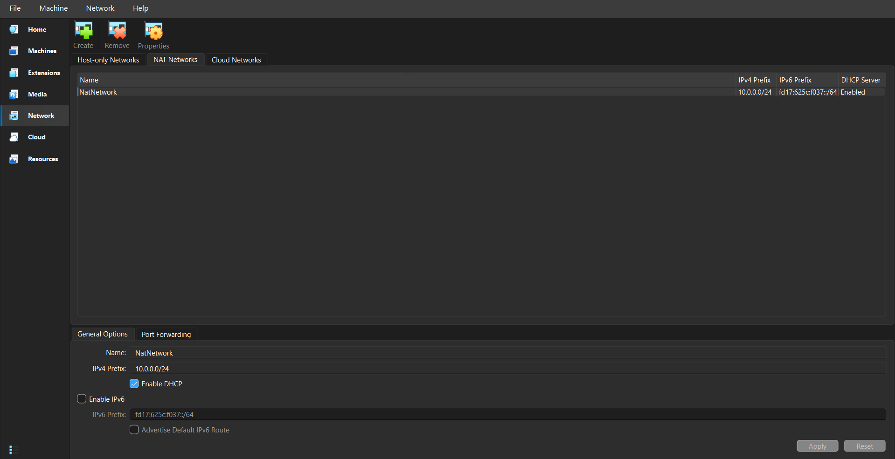
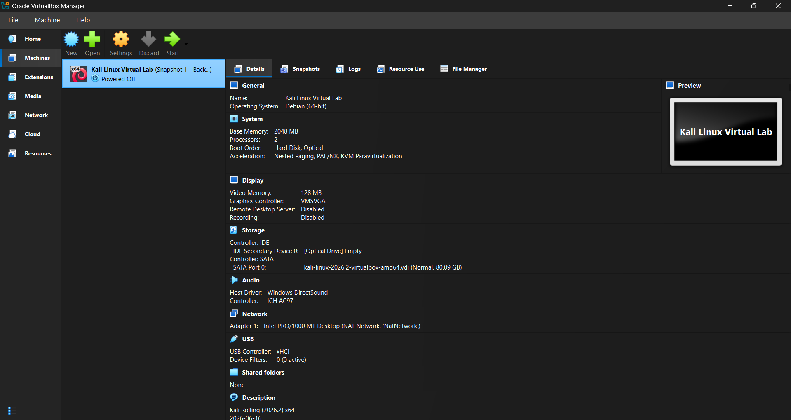
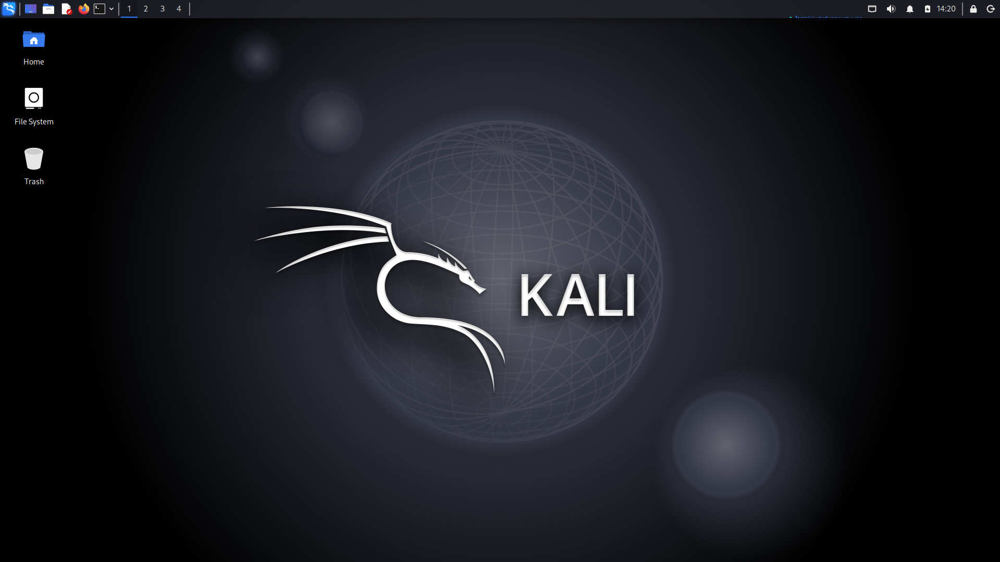
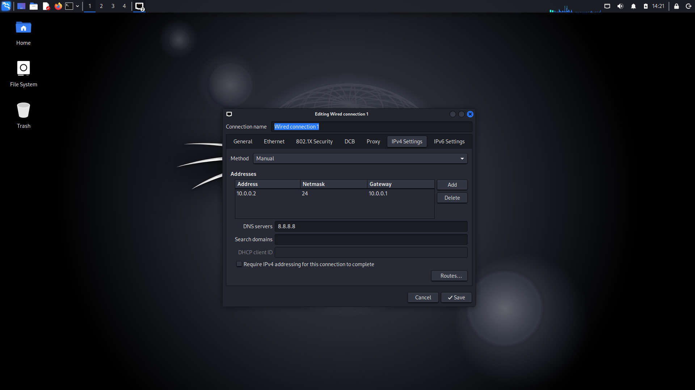
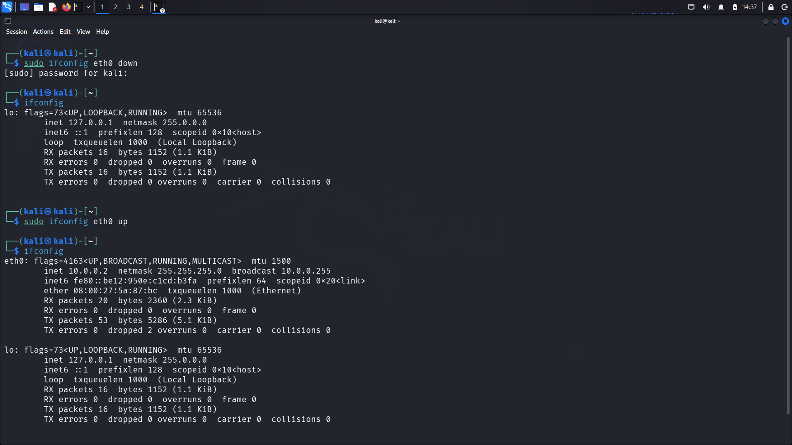

# 🔒 Cybersecurity Lab Environment Setup

> Building an isolated, controlled virtual lab environment for penetration testing, network experimentation, and ethical hacking practice using Oracle VirtualBox and Kali Linux.

---

## 📌 Project Overview

This project focuses on building and configuring a dedicated, secure virtual lab environment. Setting up security tools directly on a personal host operating system carries risks; therefore, this lab creates a controlled sandbox where network reconnaissance, vulnerability assessments, and penetration testing tasks can be executed safely without risking production networks or host devices.

---

## 🎯 Purpose of the Lab

* **Why VirtualBox?** VirtualBox operates as a Type-2 hypervisor, allowing us to deploy and test security operating systems like Kali Linux inside fully isolated virtual machines. This guarantees that penetration testing tools, network scans, and experimental configurations remain safely contained without endangering the host operating system or system files.
* **Why an Isolated Virtual Network?** Configuring VirtualBox's built-in **NAT Network (`10.0.0.0/24`)** creates a private virtual router within the hypervisor. This allows lab Virtual Machines to communicate securely with each other and reach the internet for updates while keeping the entire environment segmented from the physical local area network (LAN).
* **Snapshot & Rollback Control:** VirtualBox provides snapshot functionality, allowing you to save a clean base state of your environment. If a service breaks or system files are corrupted during testing, the virtual machine can be restored to a known-good state instantly.

---

## 💻 Lab Environment Details

| Component | Specification / Configuration Details |
| :--- | :--- |
| **Host Operating System** | Windows 11 Pro (64-bit) |
| **Hypervisor** | Oracle VM VirtualBox v7.0+ |
| **Guest OS** | Kali Linux 2026.2 (64-bit) |
| **Virtual Disk** | 80.09 GB VDI |
| **Allocated Memory (RAM)** | 2048 MB (2 GB) |
| **Allocated Processors** | 2 vCPUs |
| **Network Type** | VirtualBox NAT Network (`NatNetwork`) |
| **Subnet / Netmask** | `10.0.0.0/24` (Netmask: `255.255.255.0`) |
| **Default Gateway** | `10.0.0.1` |
| **Kali Static IP** | `10.0.0.2` |
| **DNS Server** | `8.8.8.8` (Google Public DNS) |

---

## 🧱 Step-by-Step Build & Implementation

### Step 1: Software Prerequisites (7-Zip & VirtualBox)
* **What was done:** Downloaded and installed 7-Zip file archiver and Oracle VirtualBox on the host machine.
* **Why it was done:** 7-Zip is required to extract archived `.7z`/`.zip` virtual machine images, and VirtualBox provides the virtualization platform (Type-2 Hypervisor) to host the lab machines.

---

### Step 2: VirtualBox NAT Network Configuration
* **What was done:** Created a custom global NAT Network named **`NatNetwork`** in VirtualBox with the IPv4 Prefix set to `10.0.0.0/24` and enabled DHCP.
* **Why it was done:** A NAT Network creates an isolated internal network segment for virtual machines to communicate while still providing outbound internet access through the host interface.

---

### Step 3: Importing and Deploying Kali Linux VM
* **What was done:** Downloaded the Kali Linux VirtualBox image (`.vbox`/`.vdi`), imported it into VirtualBox, renamed the virtual machine to **`Kali Linux Virtual Lab`**, and mapped its network adapter to `Adapter 1: Intel PRO/1000 MT Desktop (NAT Network, 'NatNetwork')`.
* **Why it was done:** Kali Linux serves as the primary offensive security workstation containing pre-installed penetration testing tools. Attachments to `NatNetwork` ensure it lands on the `10.0.0.0/24` subnet.

---

### Step 4: First Boot and Desktop Environment Verification
* **What was done:** Booted up the Kali Linux Virtual Machine and verified access to the Graphical User Interface (XFCE Desktop).
* **Why it was done:** Confirms that the virtual machine image imported correctly without kernel panic or display driver errors.

---

### Step 5: Static IP & Network Interface Setup
* **What was done:** Configured `Wired Connection 1` in Kali Linux Network Manager under IPv4 Settings to **Manual**:
  * **IP Address:** `10.0.0.2`
  * **Netmask:** `24` (`255.255.255.0`)
  * **Gateway:** `10.0.0.1`
  * **DNS:** `8.8.8.8`
* **Why it was done:** Assigning a static IP ensures consistent addressing across lab restart cycles, critical for logging, local routing, and targeted lab scenarios.

---

### Step 6: Interface Reset and Address Verification
* **What was done:** Executed `sudo ifconfig eth0 down` followed by `sudo ifconfig eth0 up` in the terminal to apply the new IP configuration, then verified with `ifconfig`.
* **Why it was done:** Restarting the network interface forces the OS to re-bind the network socket to the manually defined `10.0.0.2` address.

---

## ✅ Verification & Testing

To confirm the network configuration and internet connectivity, the following tests were conducted inside the Kali terminal:

1. **IP Configuration Check:** Run `ifconfig` to verify `eth0` acquired `inet 10.0.0.2` with netmask `255.255.255.0`.
2. **Internet & DNS Resolution Check:** Executed `ping -c 4 google.com` to test DNS resolution (`142.250.206.110`) and external connectivity.
3. **Gateway / Public IP Ping Test:** Executed `ping -c 4 8.8.8.8` to test direct IPv4 routing.

> **Result:** All packets were transmitted and received successfully with **0% packet loss**, confirming both internal routing and external reachability.

---

## 📸 Snapshot & Backup Strategy

* **Snapshot Name:** `Snapshot 1 - Clean Base Setup`
* **State:** Powered Off
* **Description:** Fresh installation of Kali Linux Rolling on VirtualBox with static IP (`10.0.0.2`) and isolated `NatNetwork` (`10.0.0.0/24`) fully configured and verified.
* **Purpose:** Allows instant restoration to a known-good clean state if system files are corrupted during future exploitation experiments, malware testing, or misconfigurations.

---

## 🛠️ Problems Faced & Solutions

| Issue Encountered | Root Cause | Solution Applied |
| :--- | :--- | :--- |
| **New IP configuration did not take effect immediately after saving settings.** | NetworkManager daemon cached the old DHCP lease. | Executed `sudo ifconfig eth0 down && sudo ifconfig eth0 up` in terminal to refresh the network state. |
| **VM lacked network connectivity on initial import.** | VirtualBox defaulted the VM adapter to standard `NAT` mode instead of `NAT Network`. | Modified VM Settings > Network > Attached to: **NAT Network** and selected `NatNetwork`. |

---

## 🧠 Lessons Learned

* Difference between standard **NAT** (isolated per VM) and **NAT Network** (allows VM-to-VM communication within a dedicated subnet).
* How to manually configure persistent static IPv4 settings, default gateways, and custom DNS servers in Linux.
* Command-line utilities for network interface troubleshooting (`ifconfig`, `ping`).
* The importance of taking VM snapshots prior to conducting security exercises.

---

## 🔗 Tools & Reference Links

* [VirtualBox Official Download Page](https://www.virtualbox.org/wiki/Downloads)
* [Kali Linux Custom Images](https://www.kali.org/get-kali/)
* [7-Zip Official Archiver](https://7-zip.org/download.html)

---

## 👤 Author Information

* **Name:** Musab Mohamed
* **LinkedIn:** www.linkedin.com/in/musabone1
